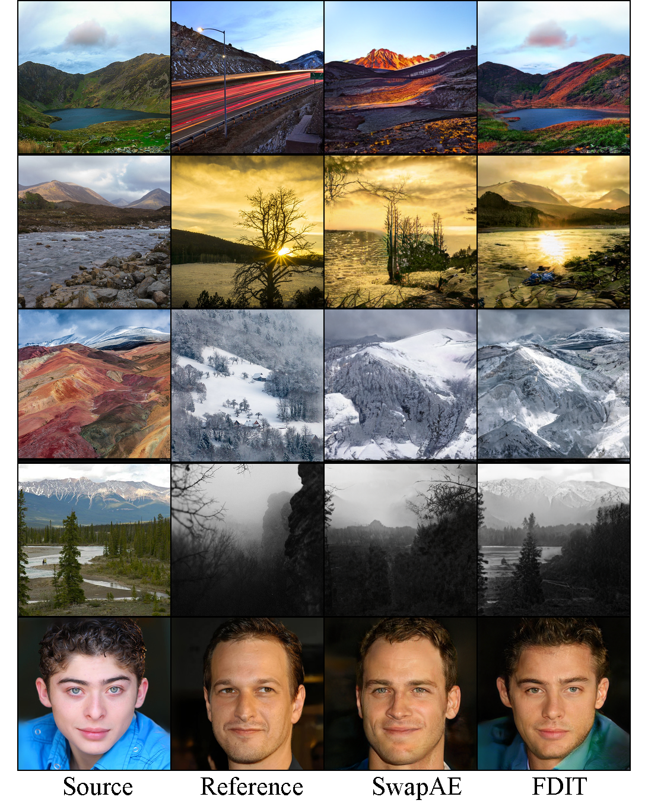

# Frequency Domain Image Translation: More Photo-realistic, Better Identity-preserving

This is the source code for our paper [Frequency Domain Image Translation: More Photo-realistic, Better Identity-preserving](https://arxiv.org/abs/2011.13611)
by Mu Cai, Hong Zhang, Huijuan Huang, Qichuan Geng, Yixuan Li and Gao Huang. 
Code is modified from [Swapping Autoencoder](https://github.com/rosinality/swapping-autoencoder-pytorch),
[StarGAN v2](https://github.com/clovaai/stargan-v2),
[Image2StyleGAN](https://github.com/pacifinapacific/StyleGAN_LatentEditor).


This is a frequency-based image translation framework that is effective for identity preserving and image realism.
Our key idea is to decompose the image into low-frequency and high-frequency components, where the high-frequency feature captures object structure akin to the identity. 
Our training objective facilitates the preservation of frequency information in both pixel space and Fourier spectral space.


<!-- ## Usage -->

## 1. Swapping Autoencoder

### Dataset Preparation

You can download the following datasets:
- Flicker Mountain ([training set](https://drive.google.com/file/d/19myZh-p9rTDQ8VxBkUAPmDpl1ZSyaqJH/view?usp=sharing), [validation set](https://uwprod-my.sharepoint.com/:f:/g/personal/mcai44_wisc_edu/EqLfFpvZ5UhElv2y0yi0rSMBLjlbqkVc5a99XNW0ujpYtA?e=KelIIh))
- Flicker Waterfall ([training set](https://drive.google.com/file/d/1ldqWrIcMtTs1qXX5uiJRLUpWNTNFkDes/view?usp=sharing), [validation set](https://uwprod-my.sharepoint.com/:f:/g/personal/mcai44_wisc_edu/EpiEonB5fCpNtaY_V4Fl2iUBzMcWgvk5YoCGrW7mLEHTfA?e=Jx0GVa))
- [CelebA-HQ](https://www.dropbox.com/s/f7pvjij2xlpff59/celeba_hq.zip?dl=0)
- [LSUN Church](https://github.com/fyu/lsun)
- [LSUN Bedroom](https://github.com/fyu/lsun)

Then place the training data and validation data in
`./swapping-autoencoder/dataset/`.

### Train the model 
You can train the model using either `lmdb` or `folder` format.
For training the FDIT assisted Swapping Autoencoder, please run:
```
cd swapping-autoencoder 
bash train.sh
```
Change the location of the dataset according to your own setting.

### Evaluate the model

#### Generate image hybrids

Place the source images and reference images under the folder `./sample_pair/source` and `./sample_pair/ref` respectively. The two image pairs should have the exact same index, such as `0.png, 1.png, ...`

To generate the image hybrids according to the source and reference images, please run:
```
bash eval_pairs.sh
```
#### Evaluate the image quality

To evaluate the image quality using Fréchet Inception Distance (FID), please run
```
bash eval.sh
```
The pretrained model is provided [here](https://pages.cs.wisc.edu/~mucai/fdit_swapae_ckpt/).
##  2. Image2StyleGAN

### Prepare the dataset 

You can place your own images or our [official dataset](https://drive.google.com/file/d/1snlVP5JIepF1jpMhH8f-V_nuYoZMfang/view?usp=sharing) under the folder `./Image2StlyleGAN/source_image`. If using our dataset, then unzip it into that folder.

```
cd Image2StlyleGAN
unzip source_image.zip 
```

### Get the weight files
To get the pretrained weights in StyleGAN, please run:
```
cd Image2StlyleGAN/weight_files/pytorch
wget https://pages.cs.wisc.edu/~mucai/fdit/karras2019stylegan-ffhq-1024x1024.pt
```

### Run GAN-inversion model:
#### Single image inversion
Run the following command by specifying the name of the image `image_name`:

```
python encode_image_freq.py --src_im  image_name
```

#### Group images inversion
Please run
```
python encode_image_freq_batch.py 
```

### Quantitative Evaluation
To get the image reconstruction metrics such as MSE, MAE, PSNR, please run:

```
python eval.py         
```

### 3. StarGAN v2

### Prepare the dataset 

Please download the CelebA-HQ-Smile dataset into `./StarGANv2/data`

### Train the model 
To train the model in Tesla V100, please run:
```
cd StarGANv2
bash train.sh
```

### Evaluation

To get the image translation samples and image quality measures like FID, please run:

```
bash eval.sh
```

### Pretrained Model
The pretrained model can be found [here](https://uwprod-my.sharepoint.com/:u:/g/personal/mcai44_wisc_edu/Ef7t8JJQUhpAiLMZZLL_UxYBCoCCPOU2ijp2xy5hKk8SeA?e=s5SQFw).


## Image Translation Results

MOS achieves state-of-the-art performance averaged on the 4 OOD datasets.



<!--  -->

## Citation

If you use our codebase or datasets, please cite our work:
```
@article{cai2021frequency,
title={Frequency Domain Image Translation: More Photo-realistic, Better Identity-preserving},
author={Cai, Mu and Zhang, Hong and Huang, Huijuan and Geng, Qichuan and Li, Yixuan and Huang, Gao},
journal={In Proceedings of International Conference on Computer Vision (ICCV)},
year={2021}
}
```